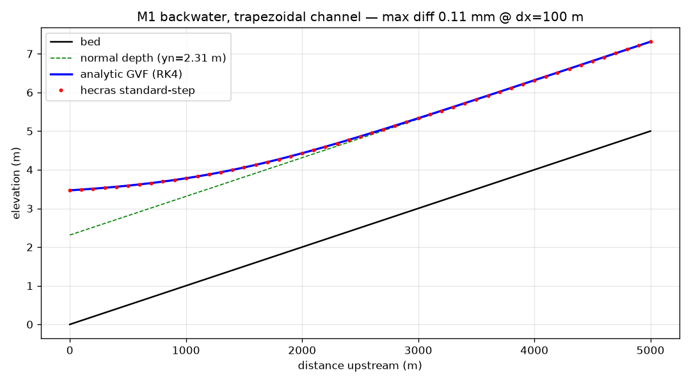
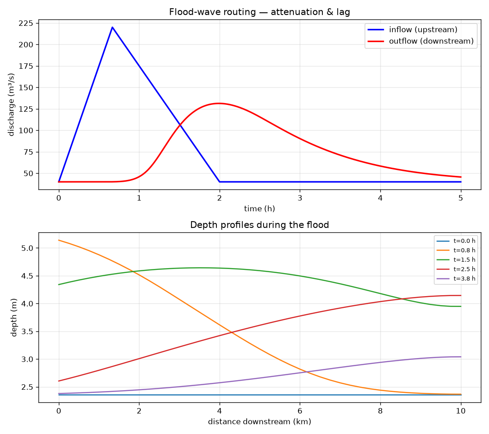
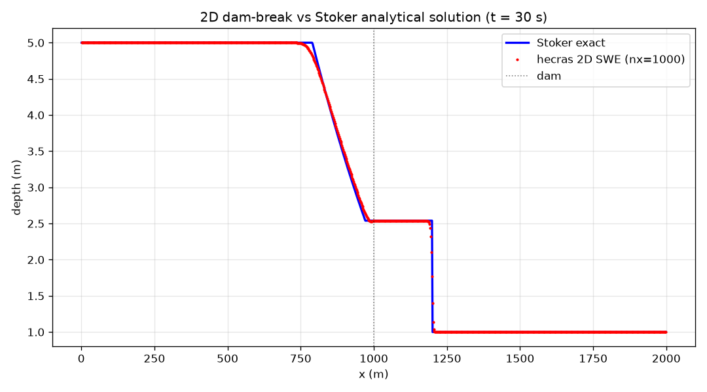
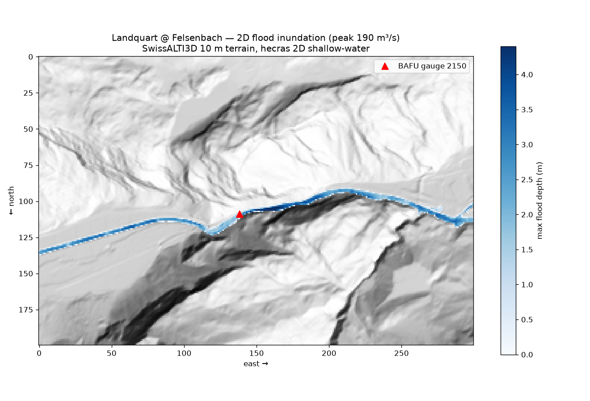
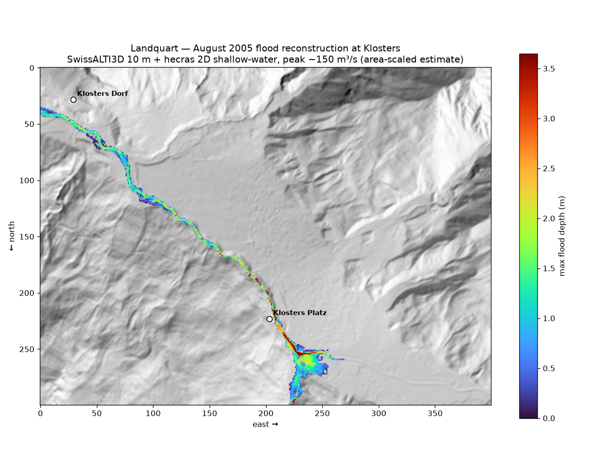

# HEC-RAS (Rust)

A **from-scratch** 1D/2D hydraulic river-analysis engine in the spirit of the US Army
Corps of Engineers' HEC-RAS, written in Rust with Python bindings. It is *not* a wrapper
around the real HEC-RAS software — the open-channel hydraulics are implemented directly,
so the engine runs natively on macOS/Linux and is scriptable from Python.

Same architecture as [`fsm-rs`](https://github.com/joelfiddes/fsm-rs): a Rust core
(`src/`) exposed to Python via [PyO3](https://pyo3.rs) + [maturin](https://www.maturin.rs).

## Status

### Phase 1 — 1D steady flow ✅

- Cross-section geometry from station/elevation points (area, wetted perimeter, top
  width, hydraulic radius, Manning conveyance).
- Froude number, critical-depth and normal-depth solvers.
- Subcritical **standard-step** (energy-method) backwater profiles along a reach.
- Validated against an independent analytical gradually-varied-flow integration
  (`examples/trapezoidal_backwater.py`): the engine shows clean **2nd-order
  convergence** to the analytic M1 backwater (error halves 4× per grid halving,
  down to ~0.002 mm).



### Phase 2 — 1D unsteady flow ✅

- Full **Saint-Venant** equations solved with the **Preissmann four-point implicit
  box scheme**; Newton-Raphson per timestep.
- Upstream discharge hydrograph; downstream normal-depth rating or prescribed stage.
- Validated (`examples/flood_routing.py`) on three independent checks: steady-state
  recovery to the Phase-1 profile (< 0.01 mm), **mass conservation** (< 0.1 %), and
  physically-correct flood-wave **attenuation + lag** (celerity ≈ kinematic estimate).



### Phase 3 — 2D shallow-water flow ✅

- Explicit **finite-volume Godunov** scheme on a Cartesian (raster/DEM) grid with an
  **HLL** approximate Riemann solver.
- **Well-balanced** via Audusse hydrostatic reconstruction of the bed source term, so a
  lake at rest over arbitrary terrain stays *exactly* at rest. Point-implicit Manning
  friction; wetting/drying; reflective and transmissive boundaries; CFL timestep.
- Validated (`examples/dam_break_2d.py` + unit tests): convergence to the exact
  **Stoker dam-break** solution (L1 → 5 mm), **well-balanced lake-at-rest** to 1e-10,
  and **mass conservation** to 1e-12 in a closed basin.



### Phase 4 — real-world application (Landquart, GR) ✅

- End-to-end pipeline on **real terrain**: swisstopo **SwissALTI3D** (2 m → 10 m) for a
  3×2 km reach of the Landquart at the BAFU gauge **Felsenbach (2150)** — a steep
  Alpine river chosen as a Central-Asian mountain-catchment analogue.
- A flood hydrograph (ramp to the ~190 m³/s mean annual flood) is routed across the DEM
  with the 2D engine — discharge injected as a mass source at the upstream channel cells,
  draining through a transmissive outlet, solid valley walls elsewhere — producing a
  **max-depth inundation map** with a closed mass budget.
- `examples/download_landquart_dem.py` (data) + `examples/landquart_flood.py` (model).



#### Case study — the August 2005 flood at Klosters

The August 2005 Alpenhochwasser was the Landquart's flood of record (391 m³/s at
Felsenbach) and devastated the Prättigau; Klosters was inundated up to ~3 m deep. There
is no gauge at Klosters, so the local peak is **area-scaled** from the Felsenbach record
(~150 m³/s for the ~150 km² upper catchment) and routed across a 4×3 km SwissALTI3D
DEM of the town reach (`examples/download_klosters_dem.py` + `examples/klosters_flood_2005.py`).
The reconstructed flood follows the real channel through town and reaches ~4 m near
Klosters Platz — the same order as the historical accounts. *(Scaled scenario, not a
measured hydrograph.)*



### Roadmap

| Phase | Scope | Status |
|------:|-------|--------|
| 1 | 1D steady gradually-varied flow (standard-step) | ✅ done |
| 2 | 1D unsteady — Saint-Venant via Preissmann implicit scheme | ✅ done |
| 3 | 2D shallow-water finite-volume on a DEM grid | ✅ done |
| 4 | Application: Landquart reach (SwissALTI3D + BAFU gauge) | ✅ done |
| → | Transfer methodology to a Central Asian reach | planned |

Units are **SI / metric** throughout.

## Install

```bash
cd ~/src/HEC-RAS
maturin develop --release      # builds the Rust extension into the active env
```

## Quickstart

```python
from hecras import CrossSection, steady_profile

# Trapezoidal section: station/elevation points + Manning's n
xs = CrossSection([0, 12, 22, 34], [6, 0, 0, 6], 0.03)
xs.normal_depth(50.0, 0.001)     # uniform-flow depth for Q, bed slope
xs.critical_depth(50.0)          # critical depth for Q

# Backwater profile along a reach (sections ordered downstream -> upstream)
sections = [xs, xs, xs]
reach_lengths = [100.0, 100.0]   # len(sections) - 1
res = steady_profile(sections, reach_lengths, q=50.0, downstream_wse=2.5)
res["wse"], res["depth"], res["froude"]   # numpy arrays, one value per section
```

### Unsteady flood routing (Phase 2)

```python
from hecras import route_unsteady

# sections ordered upstream -> downstream; inflow hydrograph at the upstream end
res = route_unsteady(
    sections, reach_lengths,
    initial_stage=z0, initial_q=q0,        # state at t=0, length N
    inflow_q=hydrograph,                   # length n_steps + 1
    dt=20.0, n_steps=900,
    downstream="normal", downstream_slope=6e-4,   # or downstream="stage", downstream_stage=...
)
res["time"], res["inflow"], res["outflow"]        # 1D arrays
res["stage"], res["discharge"]                    # 2D arrays [time, node]
```

### 2D shallow-water (Phase 3)

```python
from hecras import run_swe2d

# flat row-major fields of length nx*ny (index j*nx + i)
res = run_swe2d(
    nx, ny, dx, dy,
    bed, h0, hu0, hv0,                 # bed elevation + initial depth/momenta
    manning_n=0.03, t_end=30.0, cfl=0.45,
    bc="transmissive",                 # or "reflective"
)
res["h"], res["hu"], res["hv"]         # final 2D fields [ny, nx]
res["volume"]                          # mass-conservation diagnostic over time
```

## Develop / test

```bash
cargo test --no-default-features     # Rust unit tests (geometry, hydraulics, steady)
python examples/trapezoidal_backwater.py
```

`--no-default-features` disables the `extension-module` feature so the test harness can
link libpython; the Python wheel build (maturin) keeps it enabled.

## Theory (Phase 1)

Subcritical profiles march upstream from a downstream control, balancing the energy
equation between adjacent sections:

```
WSE_up + α·V_up²/2g  =  WSE_dn + α·V_dn²/2g  +  h_f  +  h_eddy
```

with friction loss `h_f = S̄_f · L` (average of friction slopes `S_f = (Q/K)²`,
conveyance `K = (1/n)·A·R^(2/3)`) and eddy loss `h_eddy = C·|ΔV²/2g|` using
contraction/expansion coefficients. The upstream water surface is found by bisection,
bracketed above critical depth so the physically-correct subcritical root is selected.

## License

MIT © Joel Fiddes
